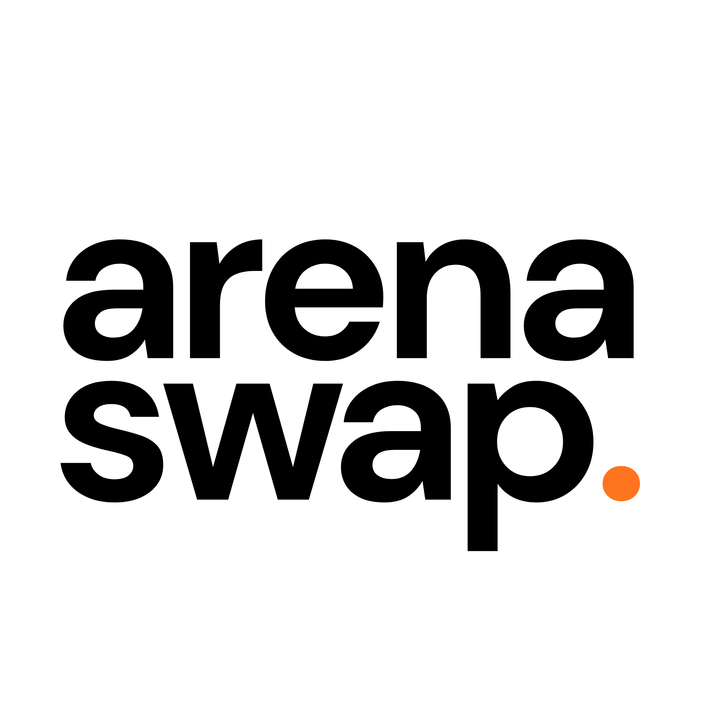

**ArenaSwap** (stylized as arenaswap.) is a browser extension that automatically scans the status of sports games and then swaps your tabs automatically so you are always watching the most exciting game.

Think [NFL RedZone](https://www.nfl.com/redzone) but for everything!

> [!WARNING]
> As of right now, this extension is in an extremely early beta stage. It is not yet available on the Chrome Web Store, and you will need to load it locally to use it. The extension is also currently only designed for desktop Chrome, so it may not work on mobile or other browsers. Use at your own risk, and please report any bugs you find!

> [!NOTE]
> The extension currently only supports NCAA Men's Basketball. In the near term we plan to add support for many other sports, as well as cross-sport comparisons.

## How to Use
1. We are not on the Chrome Web Store yet, but you can load the extension locally:
   - Clone this repository and run `npm install` at the root.
   - Run `npm run dev --workspace @arenaswap/extension` to start the extension in development mode.
2. Once the extension is loaded, it will automatically show a list of currently ongoing sports games.
3. Turn on the extension using the switch in the top right corner of the popup. Then, using the settings icon right next to the switch, you can assign a tab to each game.
4. The extension will automatically switch to the tab of the most exciting game based on our scoring algorithm. 
5. If you want to get more granular, you can adjust the sensitiity of the scoring algorith, as well as the cooldown between tab switches.

## License
At the moment, we have chosen not to include a license. This means the code is technically proprietary and cannot be used or modified by others without explicit permission from PorkyProductions.

## Authors

Primary Author: [Ryan Mullin](https://github.com/hiteacheryouare)

ArenaSwap is developed by PorkyProductions.

