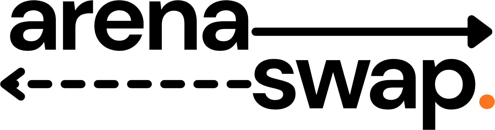
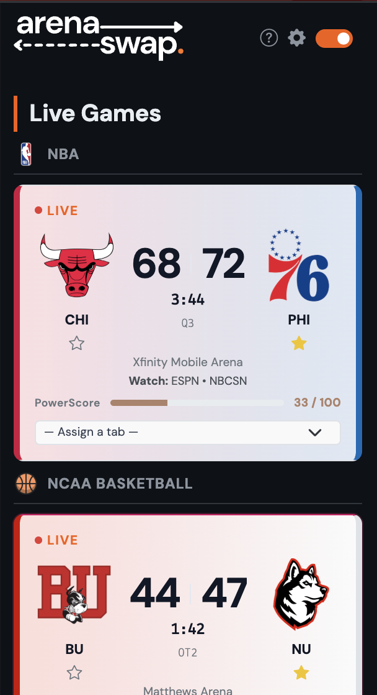
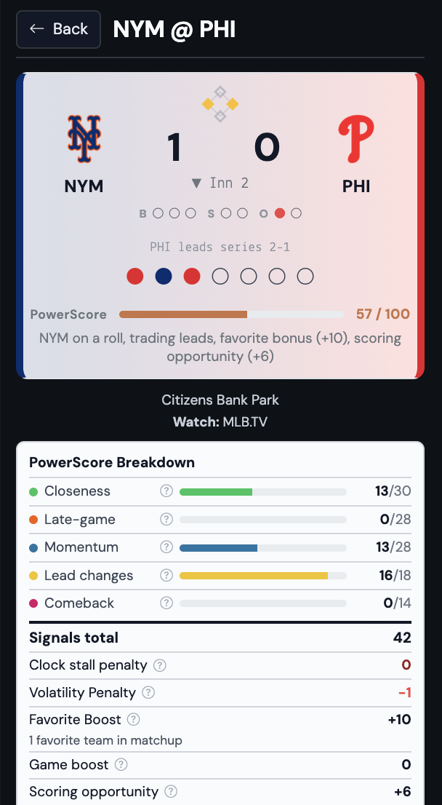
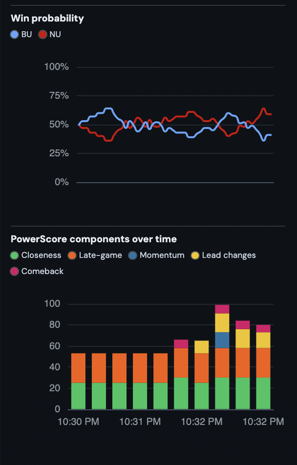

<div align="center">

<picture>
  <source media="(prefers-color-scheme: dark)" srcset="../apps/extension/public/images/full_logo_white_on_transparent.svg">
  
</picture>

<br />

**Never miss the moment.**

<br />

[](https://chromewebstore.google.com/detail/arenaswap/gibojibgihombdmmfnhnimajppamfeee)&nbsp;&nbsp;[](https://addons.mozilla.org/addon/arenaswap/)&nbsp;&nbsp;[](https://microsoftedge.microsoft.com/addons/detail/arenaswap/oeballpnidkinkcbjokogdgjckdjeeba)

<br />


[](https://github.com/jestjs/jest)


</div>

---

ArenaSwap watches every live game across 30+ leagues and automatically switches your browser tab to the most exciting one — powered by **PowerScore**, a real-time excitement algorithm built from closeness, momentum, lead changes, late-game pressure, and comebacks.

<div align="center">
  
  &nbsp;
  
  &nbsp;
  
</div>

## Features

- **Auto-Switch** — Jumps to the hottest game as fast as every 6 seconds, hands-free
- **PowerScore** — Real-time excitement score built from 5 signals and 6 adjustments
- **Game Boost** — Manually pin any game to keep it on top
- **Standby Stream** — Falls back to a calm tab when all games go quiet
- **Leagues & Favorites** — Enable any of 30+ leagues; star your teams for a built-in PowerScore bonus
- **Private by default** — No account, no tracking, no ads. Scores come directly from ESPN's public API; everything else runs locally

## Development

**Requires:** Node.js 20+, npm 10+

```bash
git clone https://github.com/hiteacheryouare/arenaswap
cd arenaswap
npm install
npm run dev
```

Load `apps/extension/.output/chrome-mv3-dev/` as an unpacked extension in your browser.

| Command | Description |
|---|---|
| `npm run dev` | Chrome dev server with hot reload |
| `npm run build:all` | Production build for Chrome, Firefox, and Edge |
| `npm run zip:all` | Zip all three for store submission |
| `npm test` | Run all tests |

## Architecture

Turborepo monorepo:

```
apps/
  extension/   → WXT browser extension (React + TypeScript)
  docs/        → Astro landing page
packages/
  core/        → Extension engine
  powerScore/  → Scoring algorithm
```

## License

ISC © [Ryan Mullin](https://github.com/hiteacheryouare) and contributors

---

<div align="center">

<picture>
  <source media="(prefers-color-scheme: dark)" srcset="assets/latticeco-white.png">
  
</picture>

<br />
<br />

<sub>ArenaSwap is a <a href="https://latticeandcompany.github.io">Lattice &amp; Company</a> project, built and maintained by <a href="https://hiteacheryouare.github.io">Ryan Mullin</a>.</sub>

</div>
