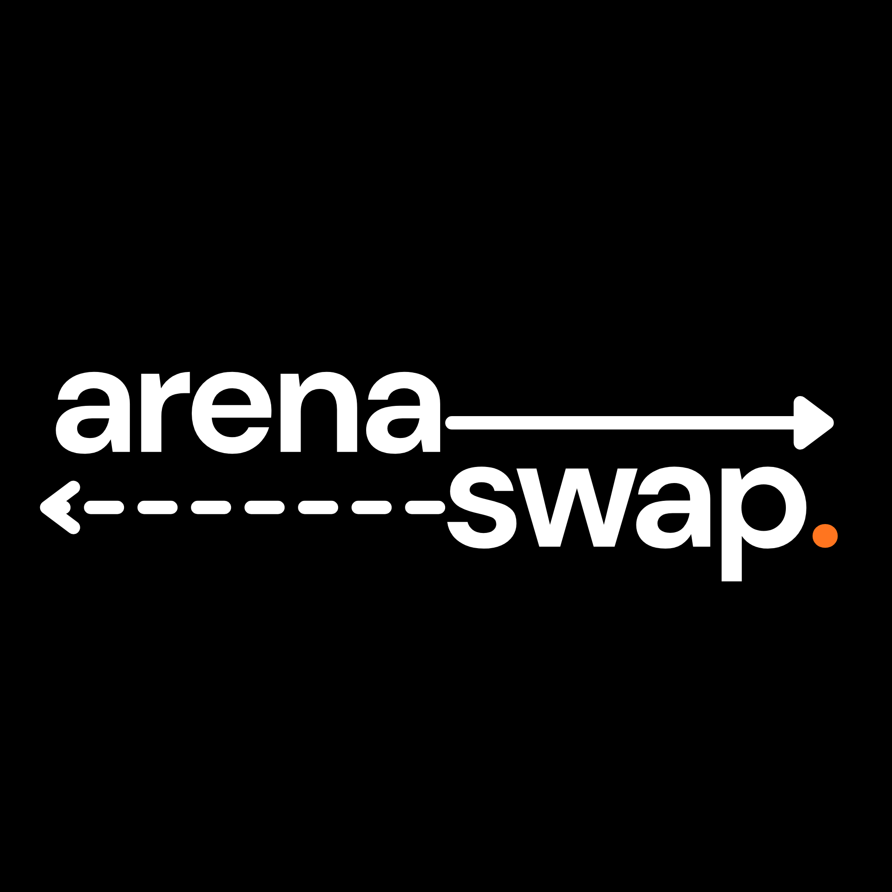

<div align="center">



<br />

**ArenaSwap** is a browser extension that monitors every live sports game across 33 leagues and automatically switches your browser tab to the most exciting one — powered by a live scoring algorithm called **PowerScore**.

*Think [NFL RedZone](https://www.nfl.com/redzone), but for every sport. All day. All season.*

<br />

[](https://chromewebstore.google.com/detail/arenaswap/gibojibgihombdmmfnhnimajppamfeee)&nbsp;&nbsp;[](https://addons.mozilla.org/addon/arenaswap/)&nbsp;&nbsp;[](https://microsoftedge.microsoft.com/addons/detail/arenaswap/oeballpnidkinkcbjokogdgjckdjeeba)

<br />


[](https://github.com/jestjs/jest)


</div>

---

## The Idea

Inspired by [this TikTok](https://www.tiktok.com/@gfedgocrazy/video/7620585631143496974?is_from_webapp=1&sender_device=pc&web_id=7621724919189866014) from one of my favorite TikTokers, [@gfedgocrazy](https://www.tiktok.com/@gfedgocrazy), and the concept behind NFL RedZone, ArenaSwap was built to solve a simple problem: when you have many games open, it's hard to always be watching the best one.

ArenaSwap fixes that. It watches every game for you and puts the best one on screen automatically.

---

## How It Works

ArenaSwap uses the **bring-your-own-tabs** model:

**01 — Open your streams.**
Pull up your games in separate browser tabs. Any service that works in a browser works with ArenaSwap — ESPN+, Peacock, Paramount+, YouTube TV, Hulu, whatever you've got.

**02 — Assign each tab once.**
Open the extension, find each game in the list, and connect it to the right tab with a single dropdown.

**03 — The best game finds you.**
Every 15 seconds, ArenaSwap scores every live game via ESPN's public API and switches to the most exciting one. It unmutes the active tab and mutes all others so you always hear the right broadcast.

When no games are live, the extension enters a low-power dormant mode and checks less frequently to save resources.

---

## 33 Leagues. If It's Live, It's Covered.

| Sport | Leagues |
|---|---|
| 🏀 Basketball | NBA, WNBA, NCAAB, NCAAW, Olympic Men's, Olympic Women's |
| 🏈 Football | NFL, NCAAF, UFL |
| 🏒 Hockey | NHL, NCAA Men's, NCAA Women's, Olympic Men's, Olympic Women's |
| ⚾ Baseball & Softball | MLB, NCAA Baseball, NCAA Softball, Olympic Baseball, World Baseball Classic |
| ⚽ Soccer | MLS, NWSL, EPL, La Liga, Bundesliga, Serie A, Ligue 1, Liga MX, UEFA Champions League, UEFA Europa League, Olympic Men's, Olympic Women's, FIFA World Cup, FIFA Women's World Cup |

---

## PowerScore

PowerScore is a 100-point live algorithm that measures how exciting a game is *right now*. Five signals feed into it:

| Signal | Ceiling | What It Measures |
|---|---|---|
| Closeness | 30 | How tight the margin is — a tied game scores highest, and counts for more as the game goes on. |
| Late-Game Pressure | 28 | Tension that rises across the whole final period (only when the game is close), with a pre-boost for tied games heading to overtime. |
| Momentum | 28 | Unanswered scoring runs that spike and then fade. |
| Lead Changes | 18 | Back-and-forth games beat one-sided affairs. |
| Comeback Factor | 14 | Is the trailing team clawing back? |

The signal ceilings deliberately sum to more than 100 and the headline is capped at 100, so a genuinely exciting game stacks into the 80s/90s (even mid-game) and a true classic hits 100, while dull games stay low — the score uses its full range. It also builds with the game rather than sitting at a flat baseline: an early or lopsided game scores low and tension ramps toward the buzzer. Live signals spike on a score and then decay, so even low-scoring sports keep a moving graph instead of flat lines. Games with frozen clocks (halftime, timeouts) take a penalty so ArenaSwap doesn't switch during stoppages. You can also set a **Favorite Team Bonus** to keep games involving your teams ranked higher.

---

## Settings

| Setting | Description |
|---|---|
| **Sensitivity (1–7)** | How large a PowerScore gap needs to be before a switch happens. |
| **Switch Cooldown** | Minimum time between switches — prevents rapid tab-flipping. |
| **Switch Delay** | Wait before switching — useful when streams lag behind live data. |
| **Favorite Team Bonus** | Extra PowerScore points for games involving teams you care about. |
| **Active Leagues** | Filter down to only the leagues you want monitored. |

---

## Local Setup

To run ArenaSwap locally from source:

```bash
# Clone and install
git clone https://github.com/hiteacheryouare/arenaswap.git
cd arenaswap
npm install

# Start the extension in development mode
npm run dev
```

Then load the unpacked extension from the `apps/extension` build output in your browser's extension manager.

---

## Monorepo Structure

```
arenaswap/
├── apps/
│   ├── extension/      # Browser extension (WXT + React)
│   └── docs/           # Documentation site
└── packages/
    ├── core/           # Core business logic
    └── powerscore/     # PowerScore algorithm
```

Built with [WXT](https://wxt.dev), React, TypeScript, Tailwind, and Bootstrap. Managed with Turborepo.

---

## FAQ

**Does ArenaSwap collect any data?**
No. Everything runs locally in your browser. No account, no tracking, no personal data. Game data comes directly from ESPN's public API.

**Will it work with my streaming service?**
Yes — if your stream runs in a browser tab, ArenaSwap can switch to it.

**Can I stop it from switching during a specific game?**
Yes. Unassign a tab from a game at any time using the dropdown in the popup. Adjusting sensitivity also reduces how often switches happen.

**Does it mute other tabs?**
Yes. When ArenaSwap switches to a game, it unmutes that tab and mutes all other assigned tabs.

---

## License

ISC License. See the [LICENSE](../LICENSE) file for details.

---

<div align="center">

Primary Author: [Ryan Mullin](https://github.com/hiteacheryouare)

*Not affiliated with or endorsed by ESPN, the NFL, NBA, NHL, MLB, MLS, UFL, or any other league, tournament, or federation tracked by this extension.*

</div>
