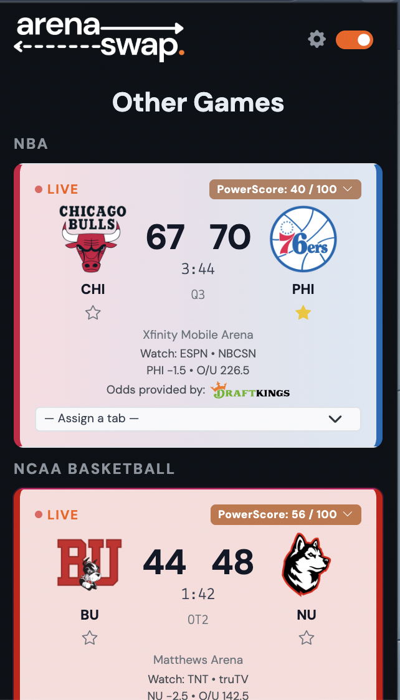

<div align="center">

<picture>
  <source media="(prefers-color-scheme: dark)" srcset="apps/extension/public/images/full_logo_white_on_transparent.png">
  
</picture>

**NFL RedZone. For every sport. In your browser.**

[](https://github.com/hiteacheryouare/arenaswap/releases)
[](LICENSE)
[](https://hiteacheryouare.github.io/arenaswap/)
[](https://hiteacheryouare.github.io/arenaswap/)
[](https://hiteacheryouare.github.io/arenaswap/)

[Website](https://hiteacheryouare.github.io/arenaswap/) · [Report a bug](https://github.com/hiteacheryouare/arenaswap/issues)

</div>

---

ArenaSwap watches every live game across 30+ leagues and automatically switches your browser tab to the most exciting one — powered by **PowerScore**, a real-time excitement algorithm.

<div align="center">

</div>

## Features

- **Auto-Switch** — Jumps to the hottest game every 15 seconds, hands-free
- **PowerScore** — Real-time excitement score built from closeness, momentum, lead changes, late-game pressure, and comebacks
- **Game Boost** — Manually pin any game to keep it on top
- **Standby Stream** — Falls back to a calm tab when all games go quiet
- **Leagues & Favorites** — Enable any of 30+ leagues; star your teams for a built-in PowerScore bonus
- **Walkthrough** — An 8-step interactive tour so you're up and running in minutes

## Install

**[→ arenaswap.app](https://hiteacheryouare.github.io/arenaswap/)** — Chrome, Firefox, and Edge

## Development

**Requires:** Node.js 20+, npm 10+

```bash
git clone https://github.com/hiteacheryouare/arenaswap
cd arenaswap
npm install
npm run dev
```

Load `apps/extension/.output/chrome-mv3-dev/` as an unpacked extension in your browser.

| Command | Description |
|---|---|
| `npm run dev` | Chrome dev server with hot reload |
| `npm run build:all` | Production build for Chrome, Firefox, and Edge |
| `npm run zip:all` | Zip all three for store submission |
| `npm test` | Run all tests |

## Architecture

Turborepo monorepo:

```
apps/
  extension/   → WXT browser extension (React + TypeScript)
  docs/        → Astro landing page
packages/
  core/        → Extension engine
  powerScore/  → Scoring algorithm
```

## License

ISC © [Ryan Mullin](https://github.com/hiteacheryouare) and contributors
